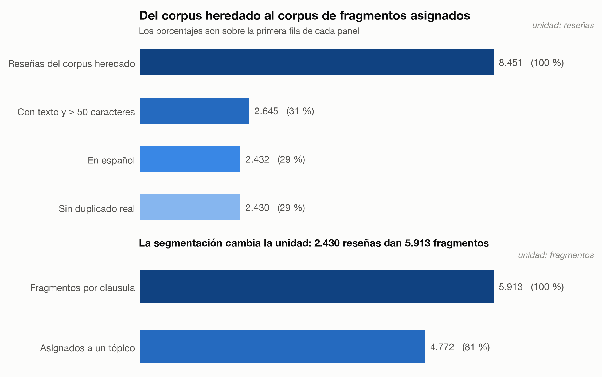
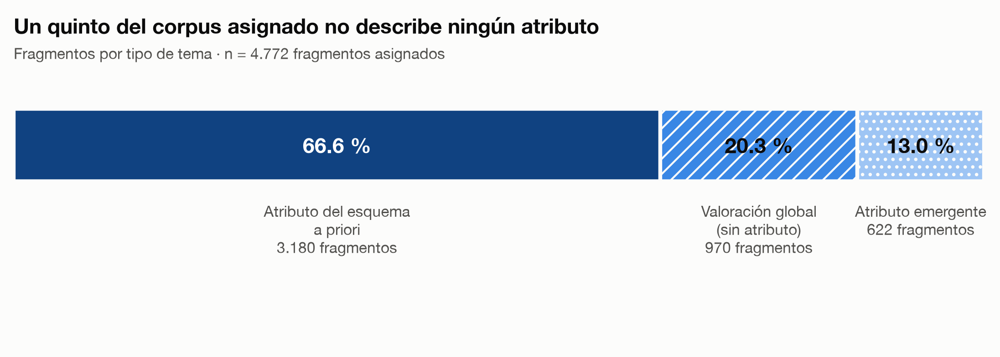
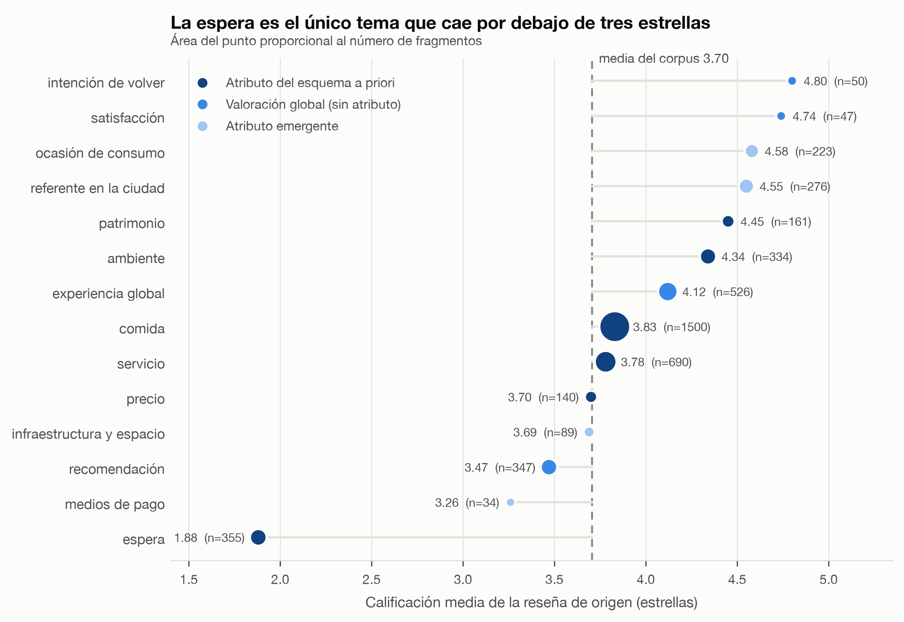
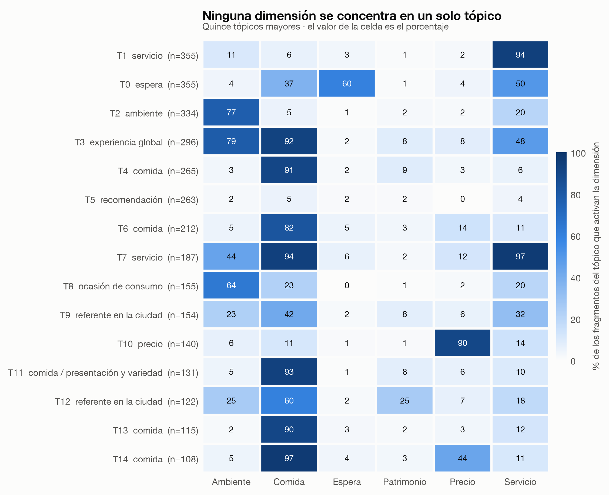

# Temas emergentes en las reseñas gastronómicas de Popayán

**Trabajo final · Text & Web Analytics**
Especialización en Data Analytics para Marketing Digital · Fundación Universitaria de Popayán

Modelado de tópicos sobre **5.913 fragmentos** de **2.430 reseñas** de Google Maps de
establecimientos gastronómicos de Popayán, contrastado con las seis dimensiones con las
que tradicionalmente se evalúa la experiencia gastronómica.

---

## El hallazgo

> **El esquema tradicional de seis dimensiones captura la mayor parte de lo que dicen los
> comensales, pero no todo.** El acuerdo entre los temas que emergen del texto y las
> dimensiones a priori es **moderado, no total: AMI 0,41 sobre una línea base de cero**.

Tres cosas que el esquema no ve:

- **Un 13 % del corpus habla de atributos que no están en las seis dimensiones**:
  la ocasión de consumo, el lugar que ocupa el local en la ciudad, la infraestructura y
  los medios de pago. Los dos últimos son invisibles para el diccionario en más del 75 %
  de sus fragmentos.
- **Un 20 % no describe nada: juzga.** «Recomendado», «volvería». Es un rasgo del género
  discursivo de la reseña, y no hay atributo que contrastar.
- **Lo que el método no agrupa es lo más crítico.** Los fragmentos sin asignar promedian
  3,20 estrellas contra 3,70 del corpus, e inocuidad (1,62) y cobro (1,87) son lo peor
  calificado del estudio.

Y un resultado accionable: **la espera es el único tema por debajo de tres estrellas**
(1,88, con el 75,8 % de reseñas de 1-2), mientras que los dos atributos mejor valorados
—ocasión de consumo (4,58) y referente en la ciudad (4,55)— son justamente emergentes.

---

## Los datos, en una figura



De 8.451 reseñas quedan 2.430 aptas en español, que al segmentarse por cláusula producen
5.913 fragmentos. El 80,7 % de ellos se asigna a alguno de los 41 tópicos.







---

## Los notebooks

| Notebook | Contenido | Colab |
|---|---|---|
| **`proyecto_final`** | **El estudio completo**: problema, objetivo, pregunta, datos, técnicas, resultados, insights y recomendaciones | [](https://colab.research.google.com/github/JLosada-Dev/topicos-popayan/blob/main/notebooks/colab/proyecto_final_colab.ipynb) |
| `00_preparacion` | Del corpus a los fragmentos, con la validación de las etiquetas | [](https://colab.research.google.com/github/JLosada-Dev/topicos-popayan/blob/main/notebooks/colab/00_preparacion_colab.ipynb) |
| `01_caracterizacion` | **Objetivo 1**: composición, calidad y distribuciones | [](https://colab.research.google.com/github/JLosada-Dev/topicos-popayan/blob/main/notebooks/colab/01_caracterizacion_colab.ipynb) |
| `02_topicos` | **Objetivo 2**: embeddings, BERTopic y sensibilidad | [](https://colab.research.google.com/github/JLosada-Dev/topicos-popayan/blob/main/notebooks/colab/02_topicos_colab.ipynb) |
| `03_evaluacion` | **Objetivo 3**: coherencia, AMI y temas transversales | [](https://colab.research.google.com/github/JLosada-Dev/topicos-popayan/blob/main/notebooks/colab/03_evaluacion_colab.ipynb) |

Los cuatro por etapa quedan como **anexo** del consolidado.

**Para leerlos sin ejecutar nada** hay tres caminos:

1. Los `.ipynb` de `notebooks/` están versionados **con sus salidas**, así que GitHub los
   renderiza directamente.
2. `docs/notebooks_html/` tiene la versión HTML autocontenida, sin referencias externas.
3. Los badges de arriba los abren en Colab.

---

## El dashboard

```bash
uv run streamlit run app/main.py
```

Se abre en `http://localhost:8501` y arranca en **1 segundo**: solo lee CSV, no recalcula
nada ni carga el modelo.

| Sección | Qué muestra |
|---|---|
| **Presentación** | Once pantallas para proyectar en una sustentación de 15 minutos |
| **Resumen** | El embudo, los indicadores clave y dos figuras |
| **Temas** | Tabla ordenable de los 14 temas; al elegir uno, sus tópicos y ejemplos |
| **Tópicos** | Los 10 términos de cada tópico, su concentración por local y 5 fragmentos |
| **Contraste** | Mapa de calor, AMI con su línea base y dispersión por dimensión |
| **Explorador** | Buscador libre, con coincidencia de palabras y con significado, comparables |

Cada indicador lleva una línea que lo explica sin jerga.

La sección **Presentación** sigue la cadena contexto → problema → objetivos → pregunta →
datos → técnicas → resultados → atributos emergentes → insights → recomendaciones →
limitaciones y cierre, con navegación adelante y atrás y un selector para saltar a
cualquier pantalla. Desde la pantalla de resultados se puede saltar al explorador con una
consulta precargada, para demostrar en vivo el límite de la técnica.

---

## Cómo está organizado

```
dataset/      los 5 archivos de datos, con su diccionario y sus hashes
src/          la lógica reutilizable
scripts/      los scripts que producen data/processed/
notebooks/    el consolidado, los cuatro por etapa y sus versiones Colab
app/          el dashboard de Streamlit
figuras/      las cuatro figuras en PNG y PDF a 300 dpi
docs/         bitácora, decisiones, evidencia por tópico y notebooks en HTML
tests/        77 pruebas con pytest
```

La regla: **`src/` es lógica, `scripts/` la ejecuta y guarda el resultado, los notebooks
y el dashboard solo leen lo guardado.** Por eso todo corre en segundos.

No viajan en el repositorio los embeddings del modelo `multilingual-e5-small`, que se
probó y se descartó: son 9 MB que ningún notebook ni el dashboard cargan —solo se
mencionan en el texto que explica por qué se descartó—. Se regeneran en cinco segundos
con `scripts/experimento_topicos.py` si se quiere repetir la comparación.

---

## Orden de ejecución

El repositorio ya trae `data/processed/` con todo calculado, así que **para leer el
análisis no hace falta ejecutar nada**. Para regenerarlo desde cero:

```bash
uv sync                    # instala las dependencias desde uv.lock
uv run pytest              # 77 pruebas

uv run python -m scripts.inventario             # manifiesto de lo heredado
uv run python -m scripts.construir_fragmentos   # el corpus de fragmentos
uv run python -m scripts.entrenar_modelo        # BERTopic, congelado y guardado
uv run python -m scripts.tabla_temas            # los 14 temas
uv run python -m scripts.contraste_dimensiones  # tabla cruzada, AMI y dispersión
uv run python -m scripts.temas_baja_masa        # los temas transversales
uv run python -m scripts.persistir_analisis     # coherencia, cohesión y sensibilidad
uv run python -m scripts.construir_tfidf        # la matriz del explorador
uv run python -m scripts.generar_figuras        # figuras/
uv run python -m scripts.evidencia_topicos      # docs/evidencia_topicos.md
uv run python -m scripts.construir_dataset      # dataset/ con sus hashes
uv run python -m scripts.diccionario_datos      # dataset/diccionario_datos.md
uv run python -m scripts.generar_notebooks      # los 10 notebooks
uv run python -m scripts.exportar_notebooks     # los ejecuta y exporta a HTML
uv run python -m scripts.revisar_dashboard      # captura el dashboard para revisarlo
```

Los pasos 1 a 3 necesitan el proyecto previo `reputacion-popayan`, que no es público. Su
ruta se configura con la variable de entorno `REPUTACION_POPAYAN`. **Del paso 4 en
adelante todo sale de `data/processed/`**, que sí viaja con el repositorio.

> `generar_notebooks` reescribe los notebooks **sin** salidas. Si cambias su contenido:
> generar primero, ejecutar después.

El proyecto usa **uv exclusivamente**. Python 3.12.

---

## Documentación

| Archivo | Contenido |
|---|---|
| `dataset/diccionario_datos.md` | Cada archivo, su unidad de análisis, sus columnas y su procedencia |
| `docs/bitacora.md` | Trazabilidad completa, con fecha, motivo y cifras |
| `docs/decisiones_metodologicas.md` | 15 decisiones con su alternativa y por qué se descartó |
| `docs/evidencia_topicos.md` | Los 41 tópicos con cinco fragmentos cada uno |

---

## Sobre el corpus y su uso académico

El corpus son **reseñas públicas de Google Maps**, recogidas para un estudio previo
(`reputacion-popayan`) y reutilizadas aquí con fines exclusivamente académicos.

**Las personas que escribieron las reseñas no son identificables.** El corpus no contiene
nombre, identificador ni foto de autor: el único dato de autoría es `autor_n_resenas`, el
número de reseñas que ha escrito cada persona, que no permite reidentificarla. Esa
anonimización viene de origen y se verificó en este trabajo.

Lo que sí aparece es lo que ya es público en la plataforma: el **texto de la reseña**, el
**nombre del establecimiento** y su ficha comercial.

**Sobre las menciones a personal.** En 33 de las 8.451 reseñas quien escribió nombra a
alguien del local por su nombre de pila o su apodo. **El corpus las conserva tal como
aparecen publicadas en Google Maps, y el análisis no las emplea como variable**: no se
extraen, no se cuentan, no entran en ninguna medición ni en ninguna figura. Se mantienen
únicamente porque eliminarlas alteraría el texto que se segmenta y se vectoriza, y con
ello los resultados dejarían de ser reproducibles a partir de la fuente original.

Dentro del pipeline, **los nombres de establecimiento se reemplazan por el marcador
`[LOCAL]`** antes de generar los embeddings, para que el modelo agrupe por lo que se dice
y no por de quién se habla.

Si reutilizas este corpus, hazlo con el mismo propósito académico y cita tanto este
trabajo como el estudio previo del que procede.

---

## Licencia

Trabajo académico. El código se ofrece para fines educativos. El corpus procede de
contenido público de terceros y se comparte solo con fines de investigación.
